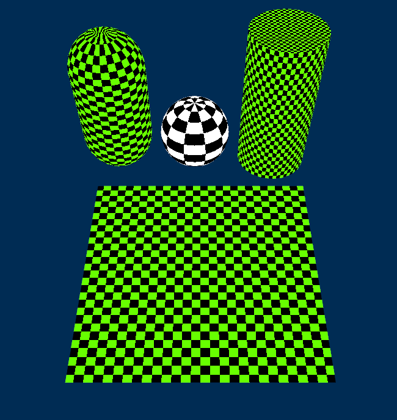
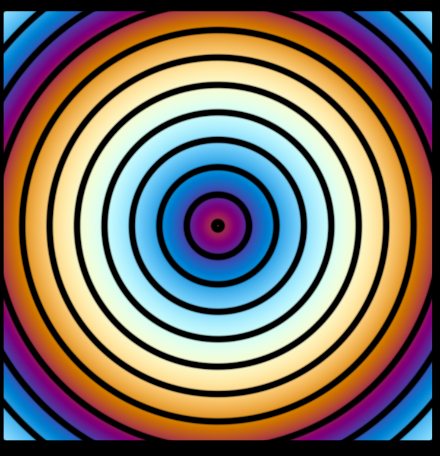
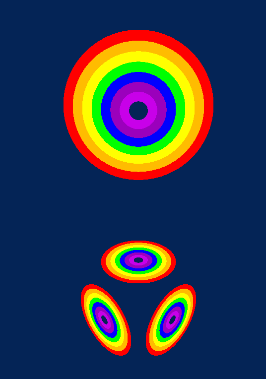
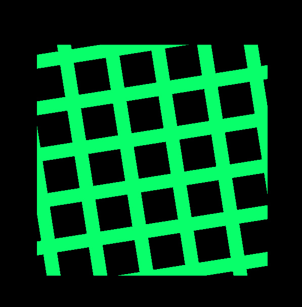
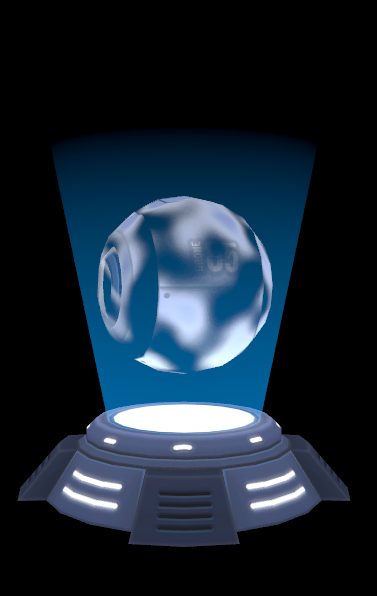
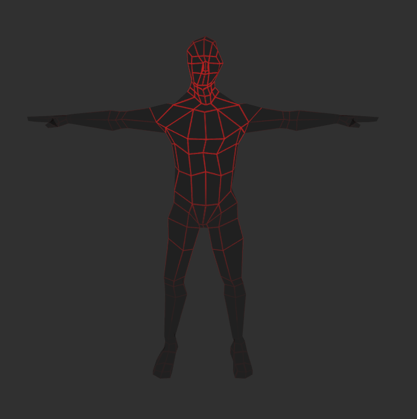
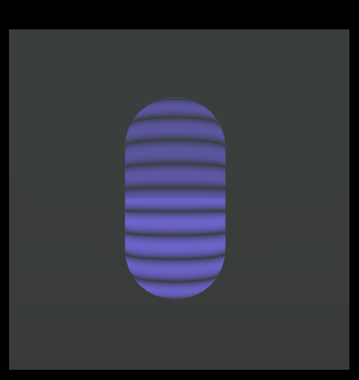
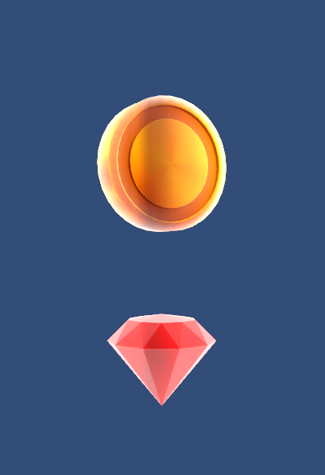
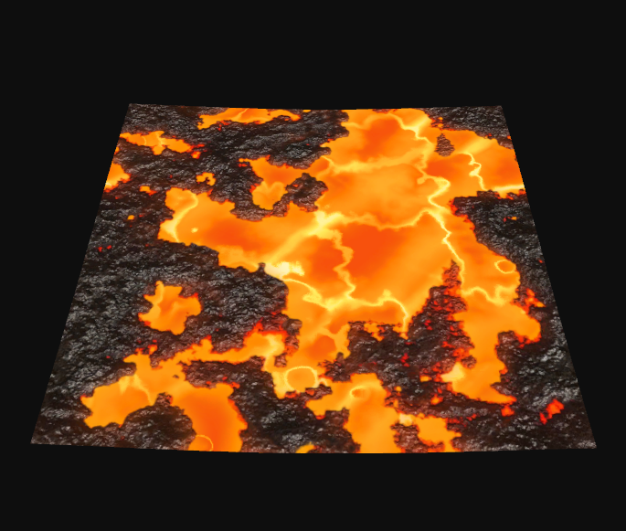
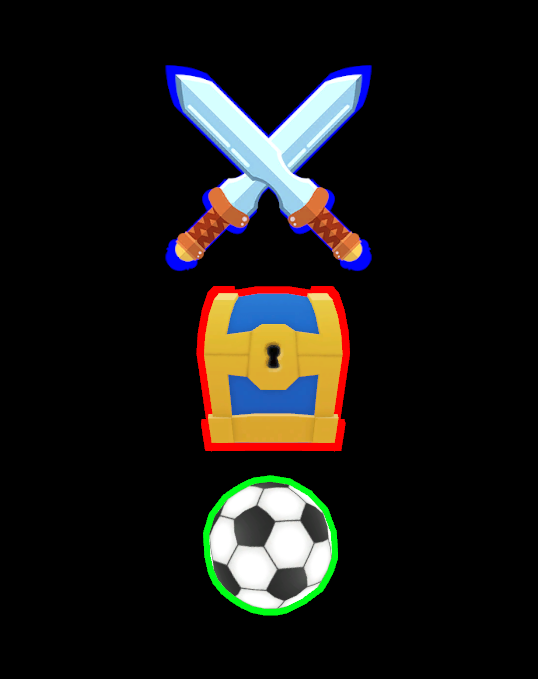

## Unity3D Shader Workbench

### Pattern Shaders
- Checker (Spherical Projection Support)

- Loop

  

- Rainbow

  

- Squares

  

### VFX Shaders

- Dissolve

  

- Hologram - 1

  

- Hologram - 2

  

- Valuable & Rim

  

- Magma

  

- Outline

  

